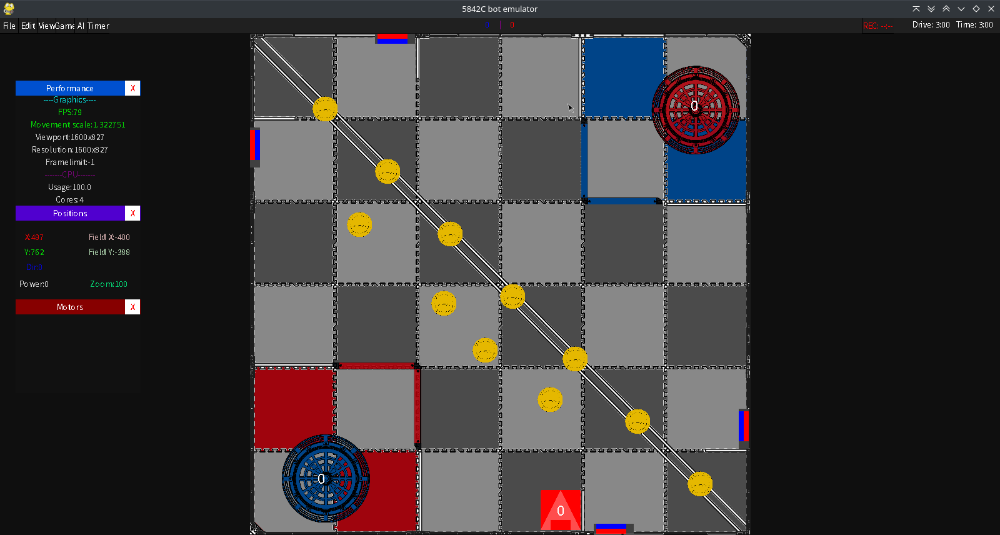

# VEX V5 Competition emulator

If IFI isnt going to do it, I will.
This fulfills the needs for a simulator for Vexcode Pro. It will eventually be used as a vessel for a machine learning model to create the perfect auton
## Installation
Future versions will include installer with autoupdate system
### Prerequisites
- `Python 3.10+`
- `Pygame` & `SDL2`
- `box2d` & `swig`(install `box2d-kengz` as well if errors occur)
- `psutil`
- `pyperclip` - For the crash handler to to copy crash info to you computer's clipboard and allow you to help contribute with reporting issues
### Installation
Run `main.py`
#### Or if you are more into command lines (Linux/Mac):
`$ cd {insert where it cloned to here}/botemu && /bin/python3 main.py` 
## Basic tutorial
This software is very complex and multifaceted. Click [Here](https://github.com/bax2004rj/botemu/wiki) to read the manualfor the most in-depth explanation
### Bot motion
Driving is currently done using tank drive (one stick y-axis per side).
- W/S simulates left side
- Arrow up/down simulates right side
- Q simulates intake
- E powers up flywheel
- Tab fires disk
### Game: Moving field
- I,J,K,L moves the field similar to WASD
- U/O zooms in/out
- Middle mouse wheel allows you to drag field (on laptops, mot OSes will let you click both buttons to simulate middleclick)
- Mouse wheel can also zoom, but the function is very broken
### Other game controls
- Space can start/stop timers
### Controller support
Most controllers (even legal Vex controllers!) can be used to control movement only. The layout was originally adapted for Nintendo Switch pro controller, but it has been tested and adapted for/with official vex controllers.